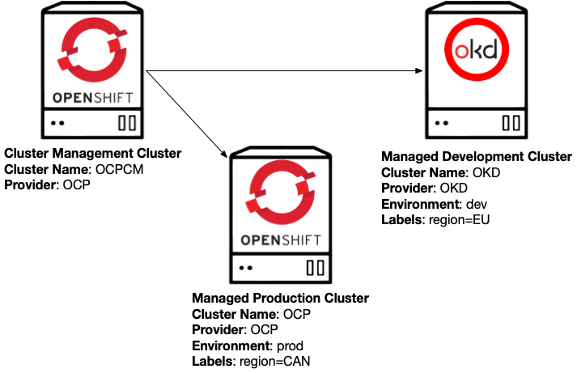
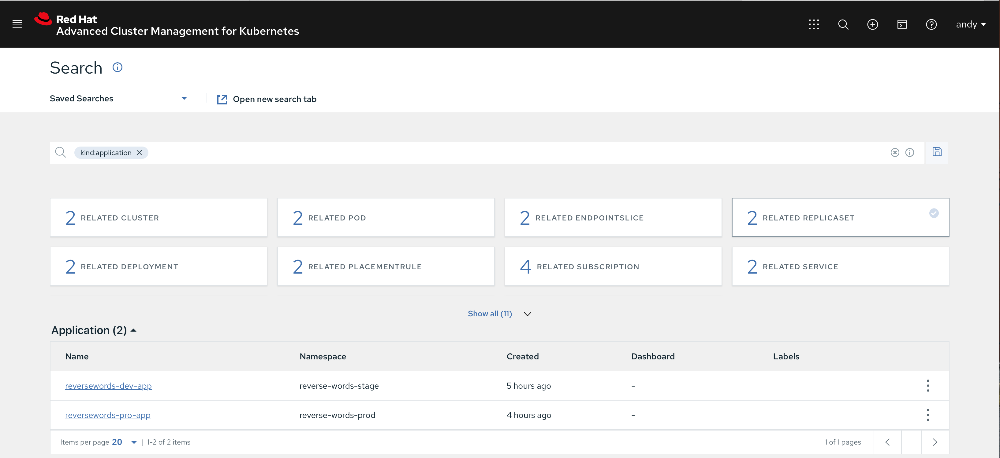
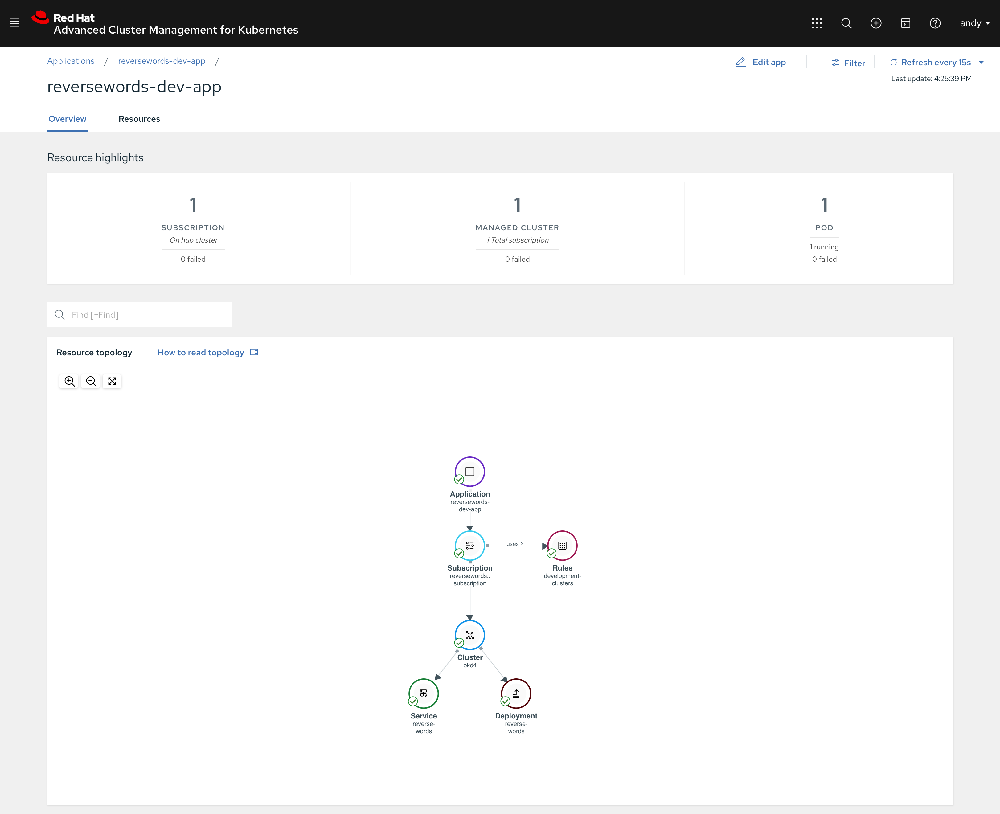

# Applications Here, Applications There! 

## Part 1 - Deploying an Application to Multiple Environments

September 28, 2020 | by Mario Vázquez 

https://www.openshift.com/blog/applications-here-applications-there-part-1-deploying-an-application-to-multiple-environments

What does it mean to manage your apps with Red Hat Advanced Cluster Management? 

In today's blog post, we are  going to show you how Red Hat Advanced Cluster Management can be used  for managing your applications across multiple environments, no matter  where they are; cloud? on-premise? We've got you covered!

Red Hat Advanced Cluster  Management features complete Application Life-cycle capabilities and  today we are going to explore some of the GitOps capabilities built in  to the product. In order to do so, we will be using the following  environment: 

> **NOTE**: Pay special attention to the different labels, as they will be used during the blog posts examples.

 

```bash
oc label node ap-okd4-master1.okd.highvail.com "region=dev"
```

In the diagram, you can see that we will be using `3` OpenShift clusters. Red Hat Advanced Cluster Management uses a hub  cluster/managed cluster model for managing the different connected  clusters, the `hub` cluster is where Red Hat Advanced Cluster Management is running, `managed` clusters are the clusters that are managed by Red Hat Advanced Cluster  Management. For the hub cluster, see the following supported products: 

| Component                                        | Version |
| :----------------------------------------------- | :------ |
| Red Hat OpenShift Container Platform             | 4.5.7   |
| Red Hat Advanced Cluster Management 2.0 Fix Pack | 2.0.2   |

You can see that our `Managed` clusters have some labels, which will be used later for placing our applications across the different environments. 

Our managed `development` cluster is named `managed-cluster1-dev` and it is deployed in the `EU` region at `AWS`. We also have a managed `production` cluster named `managed-cluster2-prod` deployed in the `US` region at `AWS`. 

###  Application Life-cycle 

The possibilities offered by  Red Hat Advanced Cluster Management with regards to application  lifecycle are plentiful. In this series of blog posts we are going to  focus on GitOps capabilities for the following use cases:

- Deploying an application to multiple environments 
- Blue-green deployment
- Application migration 
- Disaster recovery 

First, let's explore some concepts that we will be using during the blog posts: 

**Channels** Channels point to a physical  place where resources are stored for deployment. For this write-up we  are going to use Channels of type `Git`, there are different channel types for Helm, Namespaces, etc. [Learn More](https://access.redhat.com/documentation/en-us/red_hat_advanced_cluster_management_for_kubernetes/2.0/html/manage_applications/managing-applications#creating-and-managing-channels) 

**PlacementRules** You can create and manage  placement rules to define where subscriptions to Kubernetes resources  and Helm releases are deployed. Use placement rules to help you  facilitate multi-cluster deployments of your Kubernetes resources. [Learn More](https://access.redhat.com/documentation/en-us/red_hat_advanced_cluster_management_for_kubernetes/2.0/html/manage_applications/managing-applications#creating-and-managing-placement-rules)

**Subscriptions** Subscriptions serve as sets  of definitions for identifying Kubernetes resources within channels by  using annotations, labels, and versions. Subscription resources are  defined on the hub and propagated to the managed cluster(s). The  subscription controller watches the source location (channel) for new or updated resources. When a new or updated Kubernetes resource is  detected, the subscription controller can download the resource directly from the source location (channel) to managed clusters without checking the Hub cluster first (because the subscription was initially  propagated). The subscription can filter  the Helm releases to select a specific chart version. For this case, the subscription controller checks the version parameter to identify the  Helm release (chart) version to select. [Learn More](https://access.redhat.com/documentation/en-us/red_hat_advanced_cluster_management_for_kubernetes/2.0/html/manage_applications/managing-applications#creating-and-managing-subscriptions) 

**Applications** An Application object  provides a way for you to aggregate subscriptions as a group. It  provides tooling and a console with a resource that allows for the  aggregation and display of all the components in the Application. [Learn More](https://access.redhat.com/documentation/en-us/red_hat_advanced_cluster_management_for_kubernetes/2.0/html/manage_applications/managing-applications#managing-application-resources) 

### Git Repository 

GitOps patterns will be  followed to deploy our applications, the different manifests required to deploy our applications in the different environments will be stored in a Git repository, the Git structure is defined in the following table:  

| Branch   | Description                                                  |
| :------- | :----------------------------------------------------------- |
| `config` | Stores the base files for our applications, which apply to every environment |
| `prod`   | Stores the overlay files for our applications, which apply to production environments |
| `stage`  | Stores the overlay files for our applications, which apply to staging environments |

> **NOTE**: There are  multiple ways to organise the Git repository, Red Hat Advanced Cluster  Management won't force you to go one way or another, you can organise  the Git repository as it fits you best. 

### Deploying an application to multiple environments 

We are going to explore how  Red Hat Advanced Cluster Management can help us to deploy our  applications to multiple environments, for this example we have our  application, a simple web-service that reverses words. This web-service  has two releases, the `stage` release which is the version our development team is testing at the moment and the `production` release, which is the version our customers are using. 

Red Hat Advanced Cluster Management has [Kustomize](https://kustomize.io/) support, which makes it really easy to configure our applications based on the destination environments. 

As previously mentioned, we  will use the same application for both environments, but the release  will be different depending on which environment the application is  being deployed to. 

For deploying the applications, we will use the `oc` tool and a set of `yaml` manifests with the required configurations for Red Hat Advanced Cluster Management that define a `Channel`, `Subscription`, and `PlacementRule`. Everything we do from the command line can be done from the web console, as well. 

In our `oc` tool, we will have three contexts configured, one for each environment:  

| Context | Description                                                  |
| :------ | :----------------------------------------------------------- |
| `hub`   | CLI Profile connected to the `HUB` Cluster (where ACM is deployed) |
| `dev`   | CLI Profile connected to the managed `development` cluster (`managed-cluster1-dev`) |
| `pro`   | CLI Profile connected to the managed `production` cluster (`managed-cluster2-prod`) |

You can learn more about CLI profiles [here](https://docs.openshift.com/container-platform/3.11/cli_reference/manage_cli_profiles.html).

Let's review some of the resources we will be using during this example: 

**Channel** 

```yaml
apiVersion: apps.open-cluster-management.io/v1
kind: Channel
metadata:
  name: acm-app-lifecycle-blog
  namespace: open-cluster-management
spec:
  type: Git
  pathname: https://github.com/zombiefish/acm-app-lifecycle-blog.git
```

The `Channel` we are defining is a `Git` type `Channel` that will be used by our subscriptions in order to get the Kubernetes resources that deploy our application.

In this case, it is configured to get the Kubernetes resources from the Git repository at `github.com/zombiefish/acm-app-lifecycle-blog.git`. 

**Namespace** 

```yaml
apiVersion: v1
kind: Namespace
metadata:
  name: reverse-words-stage
```

When using `Subscriptions`, the namespace holding the `Subscription` will be propagated to the destination cluster. Here, we are creating a namespace named `reverse-words-stage` that will be propagated to our development clusters by the `Subscription`: 

**PlacementRule** 

```yaml
apiVersion: apps.open-cluster-management.io/v1
kind: PlacementRule
metadata:
  name: development-clusters
  namespace: reverse-words-stage
spec:
  clusterConditions:
  - type: "ManagedClusterConditionAvailable"
    status: "True"
  clusterSelector:
    matchExpressions: []
    matchLabels:
      environment: "dev"
```

The `Subscriptions` are propagated to a list of clusters returned by a `PlacementRule`, that means that we need a way to select some clusters from our  different environments and make that list available to the different `Subscriptions`, `PlacementRules` are used for that.

In this case the `PlacementRule` named `development-clusters` will return all clusters which are marked as `Available` and that match the label `environment: dev`, in our scenario this `PlacementRule` will return the managed development cluster named `managed-cluster1-dev`. 

**Subscription** 

```yaml
apiVersion: apps.open-cluster-management.io/v1
kind: Subscription
metadata:
  name: reversewords-dev-app-subscription
  namespace: reverse-words-stage
  labels:
    app: reversewords-dev-app
  annotations:
    apps.open-cluster-management.io/git-path: apps/reversewords/
    apps.open-cluster-management.io/git-branch: stage
spec:
  channel: open-cluster-management/acm-app-lifecycle-blog
  placement:
    placementRef:
      kind: PlacementRule
      name: development-clusters
```

In the previous sample, `Subscription` will take care of deploying a list of Kubernetes resources (obtained from a given `Channel`) into a list of clusters (obtained from a given `PlacementRule`). On top of that, we can define where the Kubernetes resources are located within the Git repository (Channel). 

This subscription uses the `Channel` we defined earlier, and will get the Kubernetes resources from the branch `stage`. Within that branch, it will look for Kubernetes resources in the `apps/reversewords/` path. 

**Application**

```yaml
apiVersion: app.k8s.io/v1beta1
kind: Application
metadata:
  name: reversewords-dev-app
  namespace: reverse-words-stage
spec:
  componentKinds:
  - group: apps.open-cluster-management.io
    kind: Subscription
  descriptor: {}
  selector:
    matchExpressions:
    - key: app
      operator: In
      values:
      - reversewords-dev-app
```

The `Application` will help us to create a topology view of our applications across the  clusters that are managed by Advanced Cluster Management. To do so, the `Application` matches one or more `Subscriptions`, which ultimately will create resources in the different clusters so we  can trace what was created by whom and where it was created. 

> **NOTE**: We have just reviewed the resources we will be using for deploying the application to the `development` environment, feel free to review the rest of resources directly on the  GitHub repository as they're pretty similar and self-explanatory. 

### Deploying the application to the development environment  

1.  First, we are going to create the `Channel` definition. 

    ```bash
    oc --context hub create -f \
    https://raw.githubusercontent.com/zombiefish/acm-app-lifecycle-blog/master/acm-manifests/base/00_channel.yaml

    channel.apps.open-cluster-management.io/acm-app-lifecycle-blog created
    ```
    
2.  Next, create a `Namespace` for storing our application manifests. 

    ```bash
    oc --context hub create -f \
    https://raw.githubusercontent.com/zombiefish/acm-app-lifecycle-blog/master/acm-manifests/reversewords-stage/00_namespace.yaml

    namespace/reverse-words-stage created
    ```
    
3.  Now create a `PlacementRule` that matches our managed development clusters.

    ```bash
    oc --context hub create -f \
    https://raw.githubusercontent.com/zombiefish/acm-app-lifecycle-blog/master/acm-manifests/reversewords-stage/01_placement_rule.yaml

    placementrule.apps.open-cluster-management.io/development-clusters created
    ```
    
    See the following `PlacementRule` status, note that it matched the managed development cluster named `managed-cluster1-dev`: 
    
    ```bash
    oc --context hub -n reverse-words-stage get placementrule \
        development-clusters -o yaml
    
    <OMITTED_OUTPUT>
    status:
      decisions:
      - clusterName: okd4
        clusterNamespace: okd4
    ```

4.  The `Subscription` and the `Application` can be created now targeting the development clusters via the `PlacementRule`. 

    ```bash
    oc --context hub create -f https://raw.githubusercontent.com/zombiefish/\ 
        acm-app-lifecycle-blog/master/acm-manifests/reversewords-\
        stage/02_subscription-dev.yaml

    subscription.apps.open-cluster-management.io/reversewords-dev-app-subscription created

    oc --context hub create -f https://raw.githubusercontent.com/zombiefish/\
        acm-app-lifecycle-blog/master/acm-manifests/reversewords-\
        stage/03_application-dev.yaml

    application.app.k8s.io/reversewords-dev-app created
    ```
    
    See the following `Subscription` status. Note that it says `propagated`, which means the Subscription has been sent to the destination cluster: 

    ```bash
    oc --context hub -n reverse-words-stage get subscription \
        reversewords-dev-app-subscription -o yaml
    
    <OMITTED_OUTPUT>
    status:
      lastUpdateTime: "2020-10-05T15:32:00Z"
      phase: Propagated 
    ```

5.  Finally, if we look at the development cluster, we will see our application up and running.

    ```bash
    oc --context dev -n reverse-words-stage get deployments,services,pods

    NAME                            READY   UP-TO-DATE   AVAILABLE   AGE
    deployment.apps/reverse-words   1/1     1            1           75s

    NAME                    TYPE           CLUSTER-IP       EXTERNAL-IP   PORT(S)          AGE
    service/reverse-words   LoadBalancer   172.30.178.135   <pending>     8080:30804/TCP   75s

    NAME                                 READY   STATUS    RESTARTS   AGE
    pod/reverse-words-6dfc7b864b-bbcjc   1/1     Running   0          75s
    ```
    
    If we run the same query against production cluster we will see that there is no application running there 
    ```bash
    oc --context pro -n reverse-words-stage get deployments,services,pods
    
    No resources found in reverse-words-stage namespace.
    ```
    
    We can now query our application and see that we deployed the staging release: 
    
    ```bash
    curl http://$(oc --context dev -n reverse-words-stage get service \
       reverse-words jsonpath='{.status.loadBalancer.ingress[0].hostname}'):8080
       
    Reverse Words Release: Stage Release v0.0.3. App version: v0.0.3
    ```
    
### Deploying the application to the production environment

1.  We don't need to create a new `Channel`, since we will be using the same source Git repository, but a different branch.

2. Create a `Namespace` for storing our application manifests. 

   
    ```bash
    oc --context hub create -f https://raw.githubusercontent.com/zombiefish/\
        acm-app-lifecycle-blog/master/acm-manifests/reversewords-\
        prod/00_namespace.yaml`
    ```

3. Now create a `PlacementRule` that matches our production clusters: 

    ```bash
    oc --context hub create -f https://raw.githubusercontent.com/zombiefish/\
        acm-app-lifecycle-blog/master/acm-manifests/reversewords-\
        prod/01_placement_rule.yaml
    ```
    
    See the following `PlacementRule` status. Note that it matched the managed production cluster named, `managed-cluster2-prod`.
        
    ```bash
    oc --context hub -n reverse-words-prod get placementrule \
        production-clusters -o yaml
        
    <OMITTED_OUTPUT>
    status:
      decisions:
      - clusterName: managed-cluster2-prod
        clusterNamespace: managed-cluster2-prod
    ```

4. The `Subscription` and the `Application` can be created now targeting the production clusters via the `PlacementRule`. 

    ```bash
    oc --context hub create -f https://raw.githubusercontent.com/zombiefish/\
        acm-app-lifecycle-blog/master/acm-manifests/reversewords-\
        prod/02_subscription-pro.yaml
    oc --context hub create -f https://raw.githubusercontent.com/zombiefish/\
        acm-app-lifecycle-blog/master/acm-manifests/reversewords-\
        prod/03_application-pro.yaml
    ```

    See the following `Subscription` status. Note that it says `propagated`, which means the `Subscription` has been sent to the destination cluster: 

   ```bash
    oc --context hub -n reverse-words-prod get subscription \
        reversewords-pro-app-subscription -o yaml
        
    <OMITTED_OUTPUT>
    status:
      message: Active
      phase: Propagated

   ```

5. Finally, if we look at the production cluster, we will see our application up and running.

    ```bash
    oc --context pro -n reverse-words-prod get deployments,services,pods
    
    NAME                               READY  UP-TO-DATE AVAILABLE   AGE
    deployment.extensions/reverse-words 1/1      1          1        93s
    NAME               TYPE        CLUSTER-IP       EXTERNAL-IP   PORT(S)  AGE
    service/reverse-words   LoadBalancer   172.30.100.0   a6067d9a2cd904003a1b53b65f9e1cb3-450574743.us-west-2.elb.amazonaws.com   8080:30293/TCP   96s
    NAME                               READY   STATUS    RESTARTS    AGE
    pod/reverse-words-7dd94446c-vkzr8   1/1     Running   0          94s` 
    ```

6. We can now query our application and see that we deployed the production release. 

    ```bash
    curl http://$(oc --context pro -n reverse-words-prod get service \
        reverse-words -o \ 
        jsonpath='{.status.loadBalancer.ingress[0].hostname}'):8080
        
    Reverse Words Release: Production release v0.0.2.
    App version: v0.0.2
    ​```bash 
    ```

7. Now we have different versions of our application, depending on the environment we are deploying to: 

    ```bash
    # Query development environment
    curl http://$(oc --context dev -n reverse-words-stage get service \
    reverse-words -o \
    jsonpath='{.status.loadBalancer.ingress[0].hostname}'):8080
    # Query production environment
    curl http://$(oc --context pro -n reverse-words-prod get service \
    reverse-words -o \
    jsonpath='{.status.loadBalancer.ingress[0].hostname}'):8080
    
    # Dev Query
    Reverse Words Release: Stage Release v0.0.3.
    App version: v0.0.3
    # Pro Query
    Reverse Words Release: Production release v0.0.2.
    App version: v0.0.2
    ```

Finally, let's take a look in the web console: 

ACM Applications General View



ACM Development Application View

 

---

## Part 2 - Blue/Green Deployments

**What does it mean to manage your apps with Red Hat Advanced Cluster Management?** In part one, we introduced the basic concepts for Application  Lifecycle on Red Hat Advanced Cluster Management and deployed an  application to multiple clusters. 

### Git Repository

We are using the same Git repository from part one.

|Branch|Description|
|:--|:--|
|`config`|Stores the base files for our applications that apply to every environment|
|`prod`|Stores the overlay files for our applications that apply to production environments|
|`stage`|Stores the overlay files for our applications that apply to staging environments|

### Blue / Green Deployments on Red Hat Advanced Cluster Management

In part one, we deployed our application to multiple environments, being those `Development` and `Production`. 

At this point, we have our Application running `v0.0.3` on `Development` and `v0.0.2` on `Production`. The development team has just released the version `v0.0.4` and we want to perform a blue green deployment to `Development` and `Production` using Advanced Cluster Management and its GitOps capabilities.

If you remember, we already have the required `Channel`, `PlacementRules`, `Subscriptions` and `Applications` created in Advanced Cluster Management, which means that we only need  to work with Git in order to deploy this new application version to both clusters.

#### Upgrading the application on the development environment

As stated before, we already  have all the required resources in place, we only need to update our  application definitions in Git in order to get the new application  version to the different environments. 

> **NOTE**: In this blog  post, as we're just demonstrating the GitOps capabilities, we will push  our changes directly to the different branches, this **is not** a good practice, for real world use cases, there should be a  well-defined workflow for bringing new changes to the different  environments. You can read more about it [here](https://www.openshift.com/blog/introduction-to-gitops-with-openshift).

1.  Go to our cloned Git repository. **NOTE**: If you are following the blog post in your environment, you should already have a fork from [this repository](https://github.com/zombiefish/acm-app-lifecycle-blog.git) cloned in your system 

    ```bash
    cd /path/to/acm-app-lifecycle-blog/forked/repository/
    ```
    
2.  We want to upgrade the application version on `Development` in order to validate the release is working properly before pushing the change to `Production` environment, so we will be working on `stage` branch. 

    ```bash
    git checkout stage
    ```
    
3.  Next, the overlay for the application deployment must be updated so the deployment uses the new image version (v0.0.4). 

    Development was using v0.0.3 release

    ```bash
    sed -i "s/v0.0.3/v0.0.4/g" apps/reversewords/overlays/deployment.yaml
    ```
    
4.  Before committing the change, we are going to review the current state of our application in the `development` cluster. 

    ```bash
    curl http://$(oc --context dev -n reverse-words-stage get service reverse-words \
    -o jsonpath='{.status.loadBalancer.ingress[0].hostname}'):8080
    ```
    
    As you can see, v0.0.3 is the current version running in our `Development` environment 
    
    ```bash
    Reverse Words Release: Stage Release v0.0.3. App version: v0.0.3
    ```
    
5.  Commit the file and push it to `stage` branch.

    > **NOTE**: As a reminder, this **is not** a good practice, real world use cases should follow a well-defined workflow. 

    ```bash
    git add apps/reversewords/overlays/deployment.yaml
    git commit -m "Pushed development reverse-words app version to v0.0.4"
    git push origin stage
    ```
    
6.  We already have the required `Subscription` in place, which means that after Advanced Cluster Management detects  the new commit in our repository and branch, the product will go ahead  and make the required changes to move the current state to the desired  state defined in Git.

    ```bash
    oc --context dev -n reverse-words-stage get pods
    ```
    
    You can see how the change has been detected and a new version of the pod is being deployed with the new version.
    
    ```bash
    NAME                             READY   STATUS              RESTARTS
    AGEreverse-words-5ff744d4bd-kkfvn   0/1     ContainerCreating   0          3s
    reverse-words-68b9b894dd-jfgpf   1/1     Running             0          109m
    ```
    
7.  We can now query our application and see that we deployed the v0.0.4 release.

    ```bash
    curl http://$(oc --context dev -n reverse-words-stage get service reverse-words\
    -o jsonpath='{.status.loadBalancer.ingress[0].hostname}'):8080
    
    Reverse Words Release: Stage Release v0.0.4. App version: v0.0.4
    ```

8.  We also keep the production release untouched.

    ```bash
    curl http://$(oc --context pro -n reverse-words-prod get service reverse-words\
    -o jsonpath='{.status.loadBalancer.ingress[0].hostname}'):8080
    
    Reverse Words Release: Production release v0.0.2. App version: v0.0.2
    ```
    
9.  Validation tests should occur now, and once validation tests are passed, we will go ahead and deploy the new  app version to production.  


### Upgrading the application on the production environment

1.  Go to our cloned Git repository.

    ```bash
    cd /path/to/acm-app-lifecycle-blog/forked/repository/
    ```

2.  We already upgraded and validated the new application version on `Development`. This time we are going to make the required changes to get this new version to `Production` environment, so we will be working on `prod` branch.

    ```bash
    git checkout prod
    ```

3.  Next, the overlay for the application deployment must be updated so the deployment uses the new image version (v0.0.4). Production was using v0.0.2 release

    ```bash
    sed -i "s/v0.0.2/v0.0.4/g" apps/reversewords/overlays/deployment.yaml
    ```

4.  Before committing the change, we are going to review the current state of our application in the `production` cluster.

    ```bash
    curl http://$(oc --context pro -n reverse-words-prod get service reverse-words -o \
    jsonpath='{.status.loadBalancer.ingress[0].hostname}'):8080
    ```
   
    As you can see, v0.0.3 is the current version running in our Development environment
   
    ```bash
    Reverse Words Release: Stage Release v0.0.2. App version: v0.0.2
    ```

5.  Commit the file and push it to `prod` branch. 

    > **NOTE**: As a reminder, this **is not** a good practice, real world use cases should follow a well-defined workflow 

    ```bash
    git add apps/reversewords/overlays/deployment.yaml
    git commit -m "Pushed production reverse-words app version to v0.0.4"
    git push origin prod
    ```

6.  We already have the required `Subscription` in place, that means that after Advanced Cluster Management detects the new commit in our repository and branch, the product will go ahead and  make the required changes to move the current state to the desired state defined in Git. 

    ```bash
    oc --context pro -n reverse-words-prod get pods
    ```
    You can see how the change has been detected and a new version of the pod is being deployed with the new version.

    ```bash
    NAME                             READY   STATUS              RESTARTS   AGE
    reverse-words-68795d69ff-6t4c7   0/1     ContainerCreating   0          5s
    reverse-words-7dd94446c-vkzr8    1/1     Running             0          115m
    ```

7.  We can now query our application and see that we deployed the v0.0.4 release.

    ```bash
    curl http://$(oc --context pro -n reverse-words-prod get service reverse-words -o \
    jsonpath='{.status.loadBalancer.ingress[0].hostname}'):8080
    
    Reverse Words Release: Production Release v0.0.4. App version: v0.0.4
    ```

8.   At this point, we have upgraded the reverse-words application version to v0.0.4 in `Development` and `Production` environments.

---

## Part 3 - Application Migration

### Application Migration on Advanced Cluster Management 

In the previous post we upgraded the version of our application in `Development` and `Production` clusters using Blue/Green deployment technique.

Now, we are going to explore how Red Hat Advanced Cluster Management enables us to seamlessly move our  applications between our different clusters.

#### Creating new PlacementRules and Subscription

We will create two new `PlacementRules` targeting clusters in the `EU` region and `US` region respectively. Additionally, a new `Subscription` will be used to deploy our reverse-words application in the region we want the application to run on.

1.  Create a new `Namespace` to store the required manifests.

    ```bash
    oc --context hub create -f \
        https://raw.githubusercontent.com/zombiefish/acm-app-lifecycle-blog\
        /master/acm-manifests/reversewords-region/00_namespace.yaml
    ```
    
2.  Create the required `PlacementRules` targeting clusters located in `EU` and `US` regions.

    ```bash
    # PlacementRule targeting EU region clusters
    oc --context hub create -f \
        https://raw.githubusercontent.com/zombiefish/acm-app-lifecycle-blog/\
        master/acm-manifests/reversewordsregion/\
        01_placement_rule_EU.yaml
    # PlacementRule targeting US region clusters
    oc --context hub create -f \
        https://raw.githubusercontent.com/zombiefish/acm-app-lifecycle-blog/\
        master/acm-manifests/reversewords-region/\
        02_placement_rule_US.yaml`
    ```
    
3.  Create the `Subscription` and `Application`. 

    > **NOTE**: The Subscription is currently configured to deploy the application using the `PlacementRule` matching clusters in EU region.

    ```bash
    oc --context hub create -f https://raw.githubusercontent.com/zombiefish/\
        acm-app-lifecycle-blog/master/acm-manifests/\
        reversewords-region/03_subscription-region.yaml
    oc --context hub create -f https://raw.githubusercontent.com/zombiefish/\
        acm-app-lifecycle-blog/master/acm-manifests/\
        reversewords-region/04_application-region.yaml
    ```

4.  Now, we should see our application running in the cluster located in EU (which is our `Development` cluster).

    ```bash
    oc --context dev -n reverse-words-region get deployments,services,pods
    
    NAME                                  READY   UP-TO-DATE   AVAILABLE   AGE
    deployment.extensions/reverse-words   1/1     1            1           4m39s
    NAME         TYPE     CLUSTER-IP      EXTERNAL-IP              PORT(S)          AGE
    service/reverse-words   LoadBalancer   172.30.79.111   a3115b78bce924ddc885d2b7dab766a6-1199935412.eu-central-1.elb.amazonaws.com   8080:30254/TCP   4m39s
    NAME                                 READY   STATUS    RESTARTS   AGE
    pod/reverse-words-68795d69ff-xmwc6   1/1     Running   0          4m39s
    ```
    
5.  Run the same query against the cluster located in US (`Production` cluster). See that we don't have any pods running.

    ```bash
    oc --context pro -n reverse-words-region get deployments,services,pods
    
    No resources found in reverse-words-region namespace.
    ```
    
### Migrating our Application

Let's say that due to some  law enforcement, our application cannot run on EU servers anymore and we need to move it to US-based servers. We can do that with a single  command. If you remember, we created two `PlacementRules`, one matching `EU` servers and another matching `US` servers. We will patch our `Subscription` so it stops using `EU` based servers `PlacementRule` and starts using `US` based servers `PlacementRule`. 

Changing the `PlacementRule` used by our `Subscription` will move our application from one region to the other automatically.  

1.  Patch the `Subscription`. The following patch updates the `PlacementRule` used by the `Subscription` to `us-region-clusters`.

    ```bash
    oc --context hub -n reverse-words-region patch \
       subscription.apps.open-cluster-management.io/reversewords-region-app-subscription \
       -p '{"spec":{"placement":{"placementRef":{"name":"us-region-clusters"}}}}' \
       --type=merge
   ```
   
2. Our application will be moved from `EU` cluster to `US` cluster automatically. See the commands and outputs: 

    The application will not run on `EU` (`development` cluster) anymore. 
    
    ```bash
    oc --context dev -n reverse-words-region get deployments,services,pods
    
    No resources found in reverse-words-region namespace.
    ```
    
    The application will be running on `US` (`production` cluster) now. 
    
    ```bash
    oc --context pro -n reverse-words-region get deployments,services,pods
    
    NAME                                  READY   UP-TO-DATE   AVAILABLE   AGE
    deployment.extensions/reverse-words   1/1     1            1           92s
    NAME         TYPE       CLUSTER-IP       EXTERNAL-IP      PORT(S)      AGE
    service/reverse-words   LoadBalancer   172.30.177.196   a90273a7fa3ea4015989fac522b6b36e-709976322.us-west-2.elb.amazonaws.com   8080:30375/TCP   2m33s
    NAME                                 READY   STATUS    RESTARTS   AGE
    pod/reverse-words-68795d69ff-jlktw   1/1     Running   0          92s
    ```
    
    As you just saw, by using `PlacementRules` you can migrate your applications between clusters easily. We just used a region-based `PlacementRule`, but the `PlacementRule` can be based on any labels configured on your clusters.
    

---

# Part 4 - Disaster Recovery

## Disaster Recovery on Red Hat Advanced Cluster Management

In the previous post we migrated our application across different regions using `PlacementRules`.

In this blog post we are going to see how `PlacementRules` can help us with a basic Disaster Recovery scenario.

### CONFIGURING REQUIRED ADVANCED CLUSTER MANAGEMEN MANIFESTS

We will re-use the Red Hat Advanced Cluster Management manifests used in the previous blog post, which means that we will be using the Namespace `reverse-words-region` and the Subscription `reversewords-region-app-subscription`.

We will need to create a new `PlacementRule`. This time we will include new properties to our `PlacementRule`; let's review them:

```
apiVersion: apps.open-cluster-management.io/v1
kind: PlacementRule
metadata:
  name: us-eu-region-clusters
  namespace: reverse-words-region
spec:
  clusterConditions:
    - type: "ManagedClusterConditionAvailable"
      status: "True"
  clusterSelector:
    matchExpressions:
    - key: region
      operator: In
      values:
      - EU
      - US
    matchLabels: {}
  clusterReplicas: 1
```

1. We are using the `matchExpressions` property in order to match any cluster that has a label `region` with a value of either `EU` or `US`.
2. We are using the `clusterReplicas` property in order to get only one of the clusters that match the previous expression.
3. Additionally, we are matching only `healthy` clusters.

This new `PlacementRule` will make sure that in case one of the clusters moves to a non-healthy state, the cluster returned by the `PlacementRule`changes to one on the list that has a healthy state.

### CONFIGURING SUBSCRIPTION TO USE THE NEW PLACEMENTRULE

1. Let's create the `PlacementRule` discussed in the previous section.

   ```
   oc --context hub create -f https://raw.githubusercontent.com/zombiefish/acm-app-lifecycle-blog/master/acm-manifests/reversewords-region/05_placement_rule_DR.yaml
   ```

   > If we look at the clusters reported by the PlacementRule, we will only see one cluster (`Production` in this case).

   ```
   oc --context hub -n reverse-words-region get placementrule us-eu-region-clusters -o yaml
   ```

   ```
   <OMITTED_OUTPUT>
   status:
     decisions:
     - clusterName: managed-cluster1-dev
       clusterNamespace: managed-cluster1-dev
   ```

2. Now we can go ahead and update the Subscription we used in the previous blog post. We are going to patch it to use the new `PlacementRule` we just created.

   ```
   oc --context hub -n reverse-words-region patch subscription.apps.open-cluster-management.io/reversewords-region-app-subscription -p '{"spec":{"placement":{"placementRef":{"name":"us-eu-region-clusters"}}}}' --type=merge
   ```

3. The application will run in `EU` cluster (`Development`). See the following commands and output:

   ```
   oc --context dev -n reverse-words-region get deployments,services,pods
   ```

   ```
   NAME                                  READY   UP-TO-DATE   AVAILABLE   AGE
   deployment.extensions/reverse-words   1/1     1            1           42s
   
   NAME                    TYPE           CLUSTER-IP      EXTERNAL-IP                                                                PORT(S)          AGE
   service/reverse-words   LoadBalancer   172.30.185.94   a520ed21ff982452abeacf63b0b58cc5-31012041.eu-central-1.elb.amazonaws.com   8080:32283/TCP   42s
   
   NAME                                 READY   STATUS    RESTARTS   AGE
   pod/reverse-words-68795d69ff-crzqp   1/1     Running   0          42s
   ```

4. Now, I'm going to destroy my `EU` cluster in order to simulate a disaster; let's see what happens.

   > **NOTE**: We actually destroyed the cluster, if you want to try this without destroying your cluster, you can remove the `region: EU`label from the cluster

   1. As soon as Red Hat Advanced Cluster Management detects my `EU` cluster is gone, the `PlacementRule` gets updated and now it points to the `US` cluster.

      ```
      oc --context hub -n reverse-words-region get placementrule us-eu-region-clusters -o yaml
      ```

      > The `PlacementRule` now points to `US` cluster.

      ```
      <OMITTED_OUTPUT>
      status:
        decisions:
        - clusterName: managed-cluster2-prod
          clusterNamespace: managed-cluster2-prod
      ```

   2. The application has been moved automatically to the `US` cluster.

      ```
      oc --context pro -n reverse-words-region get deployments,services,pods
      ```

      ```
      NAME                                  READY   UP-TO-DATE   AVAILABLE   AGE
      deployment.extensions/reverse-words   1/1     1            1           76s
      
      NAME                    TYPE           CLUSTER-IP       EXTERNAL-IP                                                               PORT(S)          AGE
      service/reverse-words   LoadBalancer   172.30.187.142   a1c7d218d901c40ac98375f4a9474084-1310645059.us-west-2.elb.amazonaws.com   8080:31095/TCP   78s
      
      NAME                                 READY   STATUS    RESTARTS   AGE
      pod/reverse-words-68795d69ff-ttzz5   1/1     Running   0          77s
      ```

   3. The `EU` cluster is gone.

      [](https://www.openshift.com/sysdeseng/pit-hybrid/-/raw/master/blogposts/acm/assets/eu-cluster-gone.png)

5. When the `EU` cluster is online again, it will get added to the `PlacementRule` again automatically
